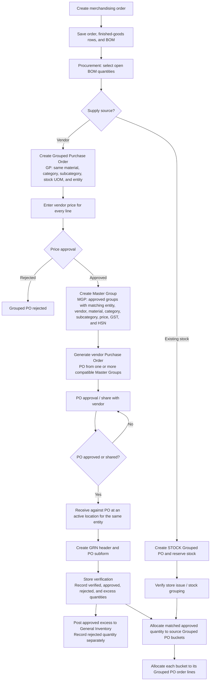
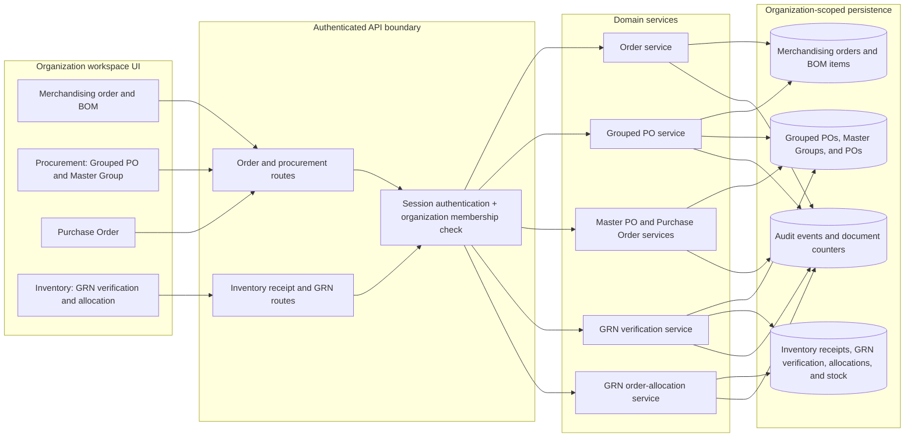

# Order to Procurement, GRN, and Allocation

This diagram follows the implemented organization-scoped workflow from merchandising order creation through raw-material receipt and order allocation.

## Business Flow

## Application Architecture

## Key Controls

- Order, BOM, purchasing, receipt, and allocation queries are scoped to the authorized organization; workspace and organization route IDs are not authorization credentials.
- A Grouped PO combines BOM lines only when their material/category/subcategory/UOM and entity match. Vendor pricing is approved separately, and the submitter cannot approve their own group.
- A Master Group cannot mix vendor and stock sources. Its source groups must match the same entity, vendor, material/category/subcategory, price, GST, and HSN.
- Vendor POs are generated from Master Groups for the same active entity and vendor. Stock-sourced Master Groups follow the internal stock-verification path, not vendor PO generation.
- GRNs require an approved or shared PO and an active entity-matched location. Verified receipts may exceed the PO/grouped requirement; approved excess and rejected quantities are excluded from the quantity available for order allocation.
- Verification sets the GRN received, accepted, and rejected quantities. Approved quantity above the remaining grouped requirement is posted to General Inventory; rejected quantity is recorded there as a separate non-available amount.
- GRN verification allocation cannot exceed the matched approved quantity or a source Grouped PO's remaining balance. Order-line allocation cannot exceed that verification allocation or the line's remaining grouped quantity.
- Receipt posting, verification, stock creation, document numbering, and audit writes use database transactions where implemented. Deleting a GRN with order allocations or consumed/reserved excess stock is blocked.

## Implementation Map

- Order and BOM creation: [order-service.ts](lib/services/orders/order-service.ts)
- Grouped PO and price approval: [grouped-purchase-order-service.ts](lib/services/orders/grouped-purchase-order-service.ts)
- Master Group creation: [master-purchase-order-service.ts](lib/services/orders/master-purchase-order-service.ts)
- Vendor PO generation: [purchase-order-service.ts](lib/services/orders/purchase-order-service.ts)
- GRN receipt and posting: [route.ts](app/api/inventory/receipts/route.ts)
- GRN verification and grouping allocation: [rm-grn-verification-service.ts](lib/services/inventory/rm-grn-verification-service.ts)
- Grouping-to-order-line allocation: [rm-grn-order-allocation-service.ts](lib/services/inventory/rm-grn-order-allocation-service.ts)